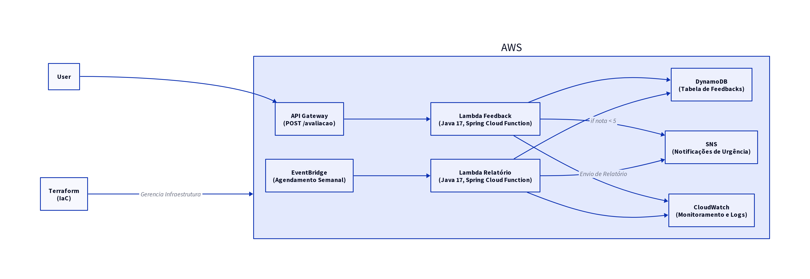

# Tech Challenge Fase 4 - Plataforma de Feedback Serverless

Entrega do Tech Challenge da Fase 4: uma plataforma serverless de feedback para estudantes avaliarem aulas, com notificação automática de feedbacks críticos e relatório semanal consolidado, hospedada na **AWS** e empacotada com **Docker**.

## Arquitetura da Solução

Arquitetura **100% Serverless** na AWS, empacotada como **container image** e publicada no **Amazon ECR**.



### Componentes
- **Amazon API Gateway (HTTP API):** ponto de entrada do `POST /avaliacao`.
- **AWS Lambda (Container Image, Java 17):**
  - `processarFeedback` — recebe o payload, persiste no DynamoDB, classifica a urgência e publica no SNS quando crítico.
  - `gerarRelatorioSemanal` — agendada via EventBridge, agrega os feedbacks da semana e publica o relatório no SNS.
- **Amazon DynamoDB:** tabela `Feedbacks` (NoSQL, billing PAY_PER_REQUEST).
- **Amazon SNS:** tópico `feedback-notifications` (e-mails para administradores).
- **Amazon EventBridge:** regra cron semanal que dispara o relatório.
- **Amazon CloudWatch:** logs e métricas das Lambdas.
- **Amazon ECR:** registry da imagem Docker das Lambdas.

## Por que Docker em vez de Terraform?

A AWS Lambda suporta nativamente **container images**, então empacotamos as duas Lambdas com um único `Dockerfile` (multi-stage, base `public.ecr.aws/lambda/java:17`) e publicamos no ECR. A criação dos demais recursos AWS é feita por **scripts Bash idempotentes** chamando o **AWS CLI**, dispensando Terraform. Veja `infra/deploy-infra.sh`.

## Estrutura do Repositório

```
.
├── Dockerfile                    # Imagem da Lambda (Java 17 + JAR sombreado)
├── docker-compose.yml            # Ambiente local: DynamoDB Local + LocalStack
├── deploy.sh                     # Atalho para o deploy na AWS
├── infra/
│   ├── config.env                # Configurações (região, nomes de recursos, e-mail)
│   ├── deploy-infra.sh           # Cria/atualiza toda a infra (substitui Terraform)
│   └── teardown-infra.sh         # Destrói toda a infra criada
├── pom.xml                       # Build Maven (gera o JAR sombreado)
├── src/main/java/...             # Código Java (Spring Cloud Function)
├── architecture.d2               # Diagrama da arquitetura (D2)
└── architecture.png              # Diagrama renderizado
```

## Pré-requisitos

- **Java 17** + **Maven 3.9+** (apenas para rodar testes locais; o build do deploy roda dentro do Docker).
- **Docker 24+** com `buildx` habilitado.
- **AWS CLI v2** configurado (`aws configure`) com credenciais que possam criar IAM, Lambda, ECR, DynamoDB, SNS, EventBridge e API Gateway.
- **jq** instalado.

## Deploy na AWS

1. (Opcional) Edite `infra/config.env` para definir região, nomes de recursos e o e-mail do administrador (`ADMIN_EMAIL`).
2. Execute o deploy:
   ```bash
   chmod +x deploy.sh infra/*.sh
   ./deploy.sh
   ```
   O script faz, em ordem:
   - Cria a tabela DynamoDB `Feedbacks` (se não existir).
   - Cria o tópico SNS `feedback-notifications` e (opcionalmente) inscreve o e-mail do admin.
   - Cria a IAM Role + Policy mínima para as Lambdas.
   - Cria/atualiza o repositório ECR e faz `docker build` + `docker push`.
   - Cria/atualiza as duas Lambdas como **Container Image** apontando para a imagem no ECR.
   - Cria a regra do EventBridge (cron semanal) e a permissão de invocação.
   - Cria o HTTP API no API Gateway com a rota `POST /avaliacao` e a permissão de invocação.
3. Confirme a inscrição do SNS no e-mail recebido (caso tenha definido `ADMIN_EMAIL`).
4. O endpoint final é exibido ao fim do script (também salvo em `infra/.deploy-state/state.env`).

Para destruir tudo:
```bash
./infra/teardown-infra.sh
```

## Ambiente Local (Docker Compose)

```bash
docker compose up -d
```

Sobe DynamoDB Local (`:8000`), LocalStack para SNS (`:4566`), faz `aws dynamodb create-table` e `aws sns create-topic` automaticamente, e levanta a Lambda emulada na porta `9000`.

Para invocar a Lambda local:
```bash
curl -XPOST "http://localhost:9000/2015-03-31/functions/function/invocations" \
  -d '{"descricao":"A aula foi confusa","nota":3}'
```

## Documentação dos Endpoints e Funções

### 1. `processarFeedback` — `POST /avaliacao`
- **Trigger:** API Gateway HTTP API.
- **Payload:**
  ```json
  {
    "descricao": "A aula foi muito confusa e o áudio estava ruim.",
    "nota": 3
  }
  ```
- **Comportamento:**
  - Gera `id` (UUID) e `dataEnvio` (ISO-8601 UTC).
  - Calcula `urgencia = nota < 5 ? "ALTA" : "NORMAL"`.
  - Salva no DynamoDB.
  - Se urgência `ALTA`, publica no SNS com **Descrição, Urgência, Data de envio e Nota** (campos exigidos pelo desafio).

### 2. `gerarRelatorioSemanal`
- **Trigger:** EventBridge — `cron(59 23 ? * SUN *)` (todo domingo 23h59 UTC).
- **Comportamento:** lê os feedbacks dos últimos 7 dias e calcula:
  - Média das avaliações
  - Total de feedbacks
  - Total de feedbacks com urgência `ALTA`
  - Quantidade de avaliações **por dia**
  - Quantidade de avaliações **por urgência**

  O relatório consolidado é publicado no SNS (chega por e-mail no admin inscrito).

## Monitoramento (CloudWatch)
- **Log Groups:** `/aws/lambda/processarFeedback` e `/aws/lambda/gerarRelatorioSemanal`.
- **Métricas nativas:** `Invocations`, `Duration`, `Errors`, `Throttles`, `ConcurrentExecutions`.
- **Alarmes recomendados (não criados automaticamente):**
  - `Errors > 0` em janelas de 5 min.
  - `Duration` próximo do `timeout`.

## Segurança
- IAM Role dedicada com **menor privilégio** (DynamoDB e SNS limitados aos recursos do projeto).
- ECR com `scanOnPush=true`.
- Sem credenciais no código — toda configuração via variáveis de ambiente.
- API Gateway pode ser restrito com **API Key** ou **Cognito** em ambiente produtivo.

## Vídeo de Demonstração
*(Insira aqui o link para o vídeo demonstrando o build da imagem Docker, o `./deploy.sh`, o envio de um feedback via Postman/Insomnia, a verificação no DynamoDB e o recebimento do e-mail de urgência.)*
